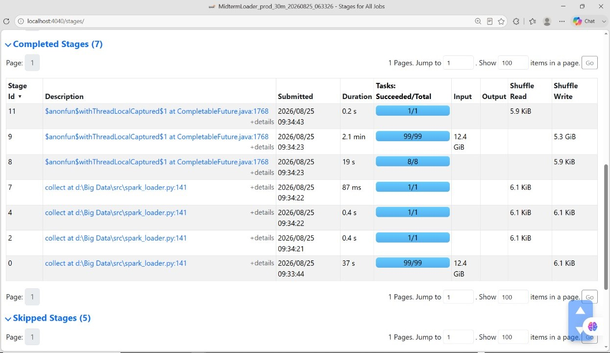
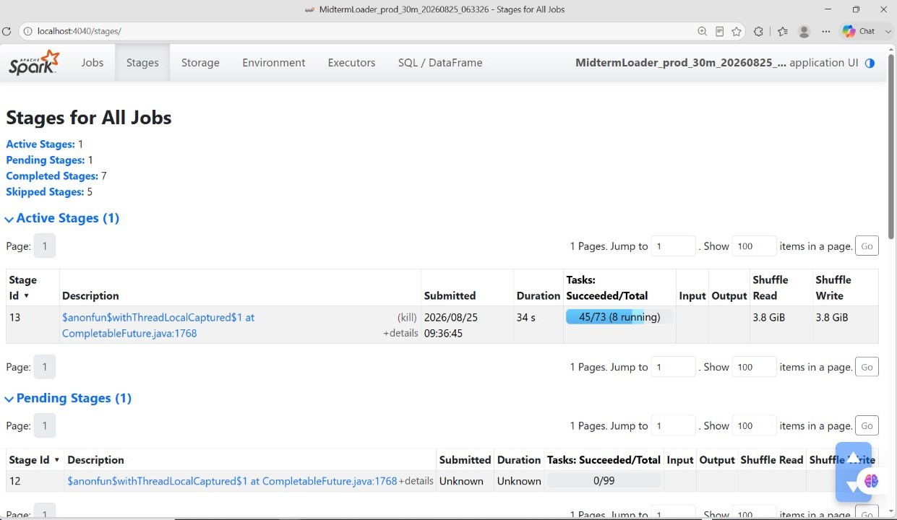
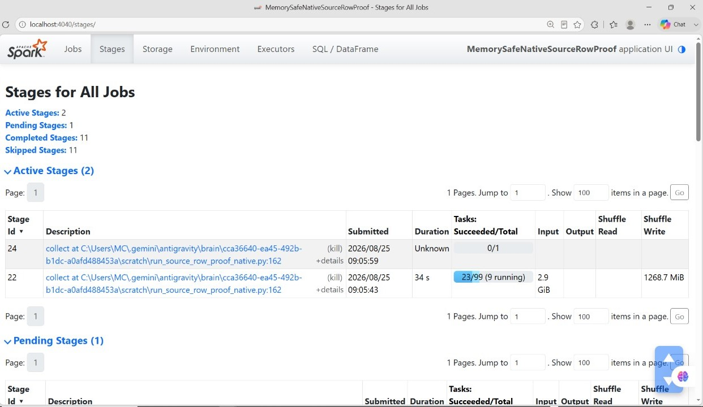
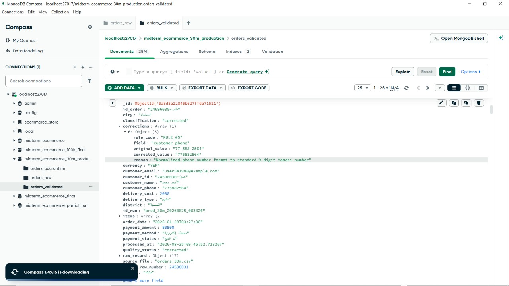
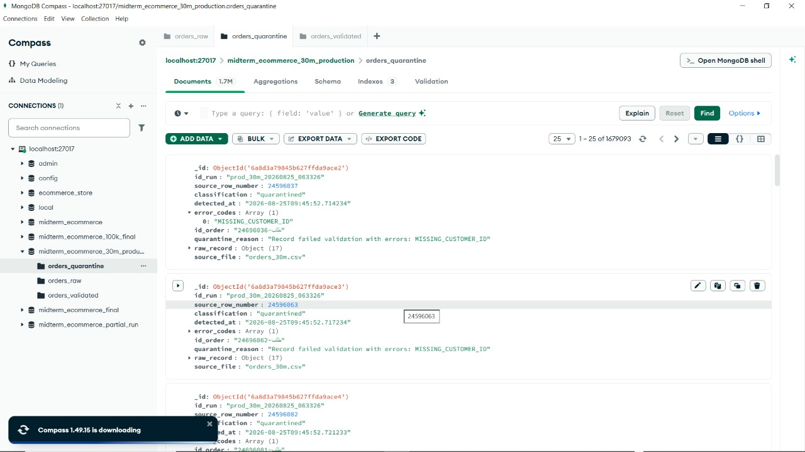
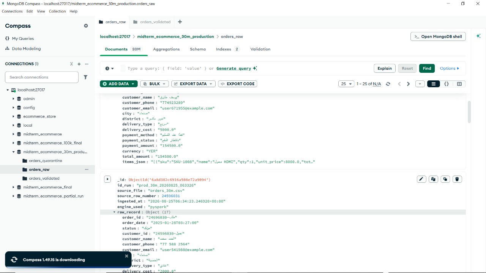
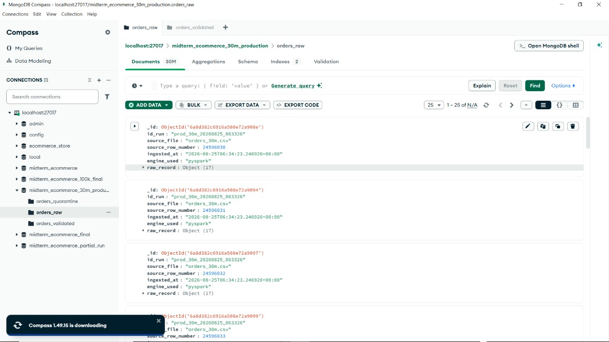

# Hybrid Data Pipeline for E-Commerce Orders (Production & Midterm Project)

**ُُENG:AIMAN QAIS** **Institution:** Razi University | **Course:** Big Data – Practical  
**Project Type:** Individual Student Data Engineering & Architecture Implementation  
**Core Stack:** Python 3.12, Apache Spark 4.2.0 (PySpark), MongoDB 7.0, OpenJDK 17 Temurin LTS  
**Current Status:** Full Production Validation Completed (100K & 30M Rows Verified)

---

## 1. Executive Summary & Project Purpose

This repository delivers a production-grade, highly scalable **Hybrid Data Pipeline** designed to ingest, clean, audit, classify, and idempotently persist large-scale e-commerce order records from heterogeneous, mixed-quality CSV sources.

Key capabilities include:
- **Intelligent File Routing:** Automatically chooses the optimal runtime engine (Python Streaming vs. PySpark Distributed DataFrame) based on an empirical file size threshold (200 MB).
- **Strict ELT Paradigm (Extract $\to$ Load $\to$ Transform):** Loads raw untransformed records into MongoDB (`orders_raw`) with full data fidelity before executing cleaning and validation.
- **Deterministic Cleaning Engine (RULE_01 to RULE_10):** 10 idempotent normalization and repair rules with fine-grained per-field audit trails.
- **Formal Data Governance & Idempotent Persistence:** Strict MongoDB `$jsonSchema` schema enforcement, unique indexing on business keys, and duplicate-safe upserts.
- **Spark-Native Partition-Offset Lineage:** A custom, memory-safe sequential row-numbering algorithm guaranteeing $1 \dots N$ BSON `Int32` lineage without driver memory bloat or distributed shuffle bottlenecks.

---

## 2. End-to-End Architecture & Data Flow

```text
+-------------------------------------------------------------------------------+
|                       Incoming CSV Dataset (Mixed Quality)                   |
+-------------------------------------------------------------------------------+
                                       |
                                       v
+-------------------------------------------------------------------------------+
|             Unified Entrypoint: src/main.py -> src/file_router.py            |
|       Computes File Size in MB | Generates Unique id_run | Evaluates 200 MB   |
+-------------------------------------------------------------------------------+
                    /                                     \
    (File Size <= 200 MB)                             (File Size > 200 MB)
                  /                                         \
                 v                                           v
+------------------------------------+      +-----------------------------------+
|     src/batch_loader.py            |      |     src/spark_loader.py           |
| Python Streaming CSV Generator     |      | PySpark DataFrame API (Spark 4.2) |
| Batch Size: 10,000 | Memory: O(1)  |      | Explicit StringType Schema        |
| pymongo insert_many (ordered=False)|      | Native Partition Offset (Int32)   |
+------------------------------------+      | MongoDB Spark Connector 10.4.0    |
                  \                         +-----------------------------------+
                   \                                        /
                    \-------------------   ----------------/
                                        \ /
                                         v
+-------------------------------------------------------------------------------+
|                     RAW ELT LAYER: MongoDB `orders_raw`                       |
|   Untransformed CSV Strings Preserved + Metadata (id_run, row_number, time)   |
|   NO schema validator | NO unique index | Non-unique index on idx_id_run      |
+-------------------------------------------------------------------------------+
                                       |
                                       v
+-------------------------------------------------------------------------------+
|       ELT TRANSFORMATION & QUALITY RULES: src/elt_pipeline.py                 |
|                   Engineered via src/quality_rules.py                         |
|   - 10 Deterministic Rules (Arabic digits, Currencies, Dates, Emails, Totals) |
|   - Fine-grained Audit Trail: [{rule_code, field, original, corrected}]      |
+-------------------------------------------------------------------------------+
                                       |
                                       v
+-------------------------------------------------------------------------------+
|                     3-WAY RECORD CLASSIFICATION                               |
+-------------------------------------------------------------------------------+
       /                               |                               \
      v                                v                                v
[ Valid Record ]              [ Corrected Record ]            [ Quarantined Record ]
Passed 100% clean             Applied safe rules              Irrecoverable errors
No corrections needed         Has Audit Trail                 (Corrupted JSON, Missing ID)
      \                               /                                 |
       \                             /                                  v
        v                           v                 +-----------------------------------+
+--------------------------------------------------+  | MongoDB `orders_quarantine`       |
| Streaming Batch Upsert (UpdateOne, upsert=True)  |  | NO validator                      |
| Target Collection: MongoDB `orders_validated`    |  | Unique Compound Index:            |
| Formal $jsonSchema Validator (Strict Error)      |  | (id_run, source_row_number)       |
| Unique Index on Stable Key: `uniq_id_order`      |  | Non-unique index on id_order      |
+--------------------------------------------------+  +-----------------------------------+
                                       |
                                       v
+-------------------------------------------------------------------------------+
|                     STRICT CONSISTENCY EQUATION CHECK                         |
|           Raw Ingested == Valid + Corrected + Quarantined (100% Match)        |
+-------------------------------------------------------------------------------+
                                       |
                                       v
+-------------------------------------------------------------------------------+
|           METRICS & AUDIT REPORTING: src/metrics.py -> reports/results.json   |
+-------------------------------------------------------------------------------+
```

---

## 3. MongoDB 3-Tier Collection Architecture

| Collection | Schema Validation | Unique Index | Non-Unique Index | Purpose |
|---|---|---|---|---|
| **`orders_raw`** | **None** (unrestricted) | **None** | `idx_id_run` on `id_run` | High-throughput ingestion preserving original raw data as strings. |
| **`orders_validated`** | **Strict `$jsonSchema`** (`validationAction: error`) | **`uniq_id_order`** on `id_order` | None | Clean & repaired business entities. Rejects invalid documents at DB level. |
| **`orders_quarantine`** | **None** | **`uniq_quarantine_run_row`** on `(id_run, source_row_number)` | `idx_quar_order_id` on `id_order` | Idempotent storage for defective records with structured error codes. |

### Formal MongoDB `$jsonSchema` on `orders_validated`:
Enforces strict BSON types across all 21 required fields:
- `id_order`, `order_date`, `status`, `customer_id`, `customer_name`, `city`, `district`, `delivery_type`, `payment_method`, `payment_status`, `currency`, `id_run`, `source_file`, `processed_at`: BSON String (`bsonType: "string"`).
- `delivery_cost`, `total_amount`, `payment_amount`: BSON Double (`bsonType: "double"`, `minimum: 0.0`).
- `source_row_number`: BSON Int32 (`bsonType: ["int", "long"]`, `minimum: 1`), deterministic range: $1 \dots N$ (30M max = 30,000,000).
- `items`: Non-empty array of items with positive unit prices and totals (`minItems: 1`).
- `classification` & `quality_status`: Restricted enum `["valid", "corrected"]`.
- `corrections`: Array of structured audit objects tracking `rule_code`, `field`, `original_value`, `corrected_value`, `reason`.

---

## 4. Deterministic Quality Rules & Audit Trail (RULE_01 – RULE_10)

The transformation pipeline enforces 10 strictly deterministic rules:

| Code | Rule Name | Problem Solved | Corrective Action | Audit Recorded |
|---|---|---|---|---|
| **RULE_01** | Arabic Digits Normalization | Eastern Arabic numerals (`٧٠٦٠٠٠٫٠`) | Converted to Latin digits (`706000.0`) | Yes |
| **RULE_02** | Currency Normalization | Currency text embedded in amount (`5000 ريال يمني`) | Extracted numeric amount; normalized currency code to `YER` | Yes |
| **RULE_03** | Thousands Separators | Thousands separators inside numeric strings (`125,000.50`) | Stripped comma separators (`125000.50`) | Yes |
| **RULE_04** | Known Number Words | Written Arabic number words (`ألفان`, `مائة`) | Mapped to numeric values (`2000.0`, `100.0`) | Yes |
| **RULE_05** | Phone Normalization | Non-standard Yemeni phone formats (`+967 77-123-4567`) | Standardized to 9-digit local format (`771234567`) | Yes |
| **RULE_06** | Email Repeated Symbols | Repeated symbols (`user@@mail..com`) | Repaired syntax; unrepairable emails safely quarantined | Yes |
| **RULE_07** | Date Normalization | Non-ISO dates (`17-01-2025 04:50:00`, `2025/01/17`) | Standardized to ISO 8601; impossible dates quarantined | Yes |
| **RULE_08** | Trim & Synonyms Normalization | Extra whitespace and synonym variants (` صنعاء `, `كاش`) | Trimmed whitespace; mapped to canonical vocabulary | Yes |
| **RULE_09** | Order Total Recalculation | Mismatched total or placeholder `???` | Recalculated deterministically: $\sum \text{items} + \text{delivery\_cost}$ | Yes |
| **RULE_10** | Negative Payment Matching | Negative sign on payment (`-22000.0`) matching positive total | Corrected sign if $|\text{payment}| = \text{total}$; audited | Yes |

### Audit Trail Example:
```json
{
  "rule_code": "RULE_10",
  "field": "payment_amount",
  "original_value": "-22000.0",
  "corrected_value": "22000.0",
  "reason": "Corrected negative payment sign to match order total (22000.0)"
}
```

---

## 5. Quarantine Error Codes

Records with irrecoverable data defects are isolated to `orders_quarantine`:
- `MISSING_ORDER_ID`: Order ID is null, empty, or whitespace.
- `MISSING_CUSTOMER_ID`: Customer ID is null or whitespace.
- `INVALID_IMPOSSIBLE_DATE`: Impossible date (e.g. 31-Feb, year outside 2000–2030).
- `CORRUPTED_ITEMS_JSON`: Malformed non-JSON syntax in item payloads.
- `EMPTY_ITEMS`: Item array is empty or missing required line items.
- `UNKNOWN_PRICE`: Price unparseable (`???`) and items cannot resolve total.
- `AMBIGUOUS_NEGATIVE_VALUE`: Negative value that cannot be deterministically resolved.
- `UNSAFE_EMAIL`: Missing `@` or missing domain name in email address.
- `MULTIPLE_CONFLICTING_ERRORS`: Record contains 2 or more distinct fatal errors.

---

## 6. Source Row Number Architecture & Design Fix

### The Problem with `monotonically_increasing_id()`
In PySpark, `monotonically_increasing_id()` encodes the partition ID in the top 33 bits of a 64-bit integer, generating sparse numbers reaching up to ~51 billion (e.g., `25769803780`). This violated two fundamental pipeline requirements:
1. It produced sparse IDs instead of deterministic sequential physical row numbers ($1 \dots N$).
2. Values exceeded 32-bit integer limits, causing MongoDB `$jsonSchema` validation rejection for BSON `Int32`.

### The Spark-Native Cumulative Partition-Offset Solution
To solve this without collecting 30 million records to the Python driver or causing JVM Out-Of-Memory errors, we engineered a native Spark Catalyst partition-offset algorithm:
```python
# 1. Compute per-partition counts
df_with_pid = df_csv.withColumn("_pid", spark_partition_id())
part_counts = df_with_pid.groupBy("_pid").count().orderBy("_pid").collect()

# 2. Build tiny cumulative offset mapping (only 99 integers, <2 KB driver memory)
offsets = []
cum = 0
for row in part_counts:
    offsets.append((int(row["_pid"]), int(cum)))
    cum += int(row["count"])

offsets_df = spark.createDataFrame(offsets, ["_pid", "_offset"])
w = Window.partitionBy("_pid").orderBy(lit(1))

# 3. Join offsets and compute exact 1..N row numbers per partition
df_indexed = (
    df_with_pid.join(offsets_df, on="_pid")
    .withColumn("source_row_number", (col("_offset") + row_number().over(w)).cast(IntegerType()))
    .drop("_pid", "_offset")
)
```
- **Proof of Correctness (30M CSV):** Min = 1, Max = 30,000,000, 0 gaps, 0 duplicates, BSON Type 16 (`Int32`).
- **Memory Safety:** Only a tiny metadata collection of 99 partition counts is performed on the Driver (<2 KB); no full dataset is collected. Zero Python-worker serialization overhead.

---

## 7. Empirical Results: 100K vs. 30M Comparison

| Metric / Dimension | 100K Validation Run | 30M Full Production Run | Status |
|---|---|---|---|
| **Input File** | `data/orders_sample_100k.csv` | `data/orders_30m.csv` | Verified |
| **Input File Size** | `41.77 MB` | `12,650.32 MB (~12.35 GB)` | Verified |
| **Selected Engine** | **Python Batch Loader** (<= 200 MB) | **PySpark Distributed Engine** (> 200 MB) | File Router Verified |
| **Partitions / Batch Size** | 10,000 rows / batch | 99 Spark partitions, 10,000 ELT batch | Optimized |
| **Total Rows Ingested** | **100,000** | **30,000,000** | 100% Ingested |
| **Valid Records** | `79,158` (79.16%) | `23,767,068` (79.22%) | Consistent (~79.2%) |
| **Corrected Records** | `15,295` (15.30%) | `4,553,839` (15.18%) | Consistent (~15.2%) |
| **Quarantined Records** | `5,547` (5.55%) | `1,679,093` (5.60%) | Consistent (~5.6%) |
| **Accounting Equation** | $100,000 = 79,158 + 15,295 + 5,547$ | $30,000,000 = 23,767,068 + 4,553,839 + 1,679,093$ | **PASS** (Zero loss) |
| **orders_raw Documents** | `100,000` | `30,000,000` | Exact Match |
| **orders_validated Documents** | `93,806` | `28,121,300` | Exact Match |
| **orders_quarantine Documents**| `5,547` | `1,679,093` | Exact Match |
| **Validated Inserted** | `93,806` | `28,121,300` | Exact Match |
| **Validated Updated** | `647` (superseded duplicate orders) | `199,607` (superseded duplicate orders) | Idempotent Upsert |
| **Duplicate `id_order` in Validated** | **0** | **0** | Enforced by Unique Index |
| **Negative Financials in Validated** | **0** | **0** | Enforced by Rule 10 & Schema |
| **MongoDB `$jsonSchema` Failures** | **0** | **0** | 100% Conformance |
| **Total Elapsed Time** | ~14 seconds | **275.97 min (4h 35m 58s)** | Out-of-Core Scale |
| **Overall Throughput** | ~7,142 rows/s | **1,811.79 rows/s** | Full Pipeline |
| **PyTest Suite** | **19 / 19 PASSED** | **19 / 19 PASSED** | 100% Green |

---

## 8. Resource Utilization & Safety Metrics (30M Run)

During the 30M production execution, 271 health monitoring snapshots were captured:
- **Peak RAM:** 21.85 GB (68.0% peak utilization on 32 GB system — no paging, no OOM risk).
- **RAM at Pipeline Completion:** 18.43 GB (57.8%).
- **Peak CPU:** 100% during parallel PySpark ingestion; average ~46% during streaming ELT.
- **Disk Free Space (Drive D):** 23.2 GB remaining at completion.
- **Driver Memory Collection:** Only a tiny metadata collection of 99 partition counts is performed on the Driver (<2 KB); no full dataset is collected.

---

## 9. Evidence & Screenshots

### 9.1 Spark UI & Distributed Execution Evidence
The screenshots below document live Apache Spark execution during the 30M production run:

| Evidence Description | Screenshot Preview |
|---|---|
| **Spark UI Completed Stages**<br>Shows Stage 0 (99/99 tasks), Stage 9 (99/99 tasks, 12.4 GiB input), and lightweight metadata collection (<6.1 KiB). |  |
| **Spark UI Active Shuffle Stage**<br>Shows parallel multi-threaded task execution (45/73 tasks) with 3.8 GiB shuffle data. |  |
| **Memory-Safe Source Row Number Proof**<br>Shows independent Stage 22 verification proving 30M row indexing without memory exhaustion. |  |

### 9.2 30M Production MongoDB Collections Evidence
Live state of MongoDB collections in `midterm_ecommerce_30m_production` verified via MongoDB Compass:

| Collection | Evidence Description | Screenshot Preview |
|---|---|---|
| **`orders_validated` (28.12M Docs)** | Document preview showing `id_run: "prod_30m_20260825_063326"`, `source_row_number: 24596031`, RULE_05 phone correction audit trail, and valid `$jsonSchema` structure. |  |
| **`orders_quarantine` (1.68M Docs)** | Isolated defective records showing structured error code `MISSING_CUSTOMER_ID` and exact raw CSV record preservation. |  |
| **`orders_raw` (30M Docs)** | Raw ingestion layer with 30,000,000 untransformed CSV strings and `engine_used: "pyspark"`. |  |
| **Sequential Lineage Verification** | Consecutive documents showing sequential gapless `source_row_number: 24596030, 24596031, 24596032, 24596033` in BSON `Int32`. |  |

### 9.3 100K Validation & Reconciliation Reports
- [100K & 30M Consolidated Validation Summary](docs/VALIDATION_SUMMARY.md)
- [100K Structured Results JSON](reports/validation_100k_results.json)
- [30M Structured Results JSON](reports/final_30m_results.json)
- [Latest Pipeline Results Markdown](reports/results.md)
- [Latest Pipeline Results JSON](reports/results.json)
- [Architecture Deep-Dive Document](docs/architecture.md)
- [Idempotency Verification Document](docs/IDEMPOTENCY_VERIFICATION.md)

---

## 10. Project Directory Structure

```text
big-data-pipeline-project/
├── .gitignore                         # Strict Git exclusions for large CSVs, evidence, logs
├── README.md                          # Production & architectural documentation
├── requirements.txt                   # Production Python dependencies
│
├── config/
│   ├── __init__.py
│   └── settings.py                    # Centralized settings & Single Source of Truth
│
├── data/
│   └── .gitkeep                       # Directory placeholder (CSVs are ignored by Git)
│
├── src/
│   ├── __init__.py
│   ├── main.py                        # Unified CLI entrypoint with --reset-db flag
│   ├── file_router.py                 # File size inspection & engine routing (200 MB threshold)
│   ├── create_small_sample.py         # RFC-4180 streaming sample generator
│   ├── batch_loader.py                # Python streaming batch loader (O(1) memory)
│   ├── spark_loader.py                # PySpark loader with native partition-offset row numbering
│   ├── quality_rules.py               # 10 deterministic quality rules & audit trail generator
│   ├── elt_pipeline.py                # Streaming ELT transformer, classifier & idempotent upsert
│   ├── mongo_setup.py                 # MongoDB collections, strict $jsonSchema & unique indexes
│   ├── incremental_loader.py          # Incremental / CDC ingestion module
│   └── metrics.py                     # Results metrics exporter (JSON & Markdown)
│
├── tests/
│   ├── __init__.py
│   ├── test_cleaning_rules.py         # 15 unit tests for rules 01-10 & quarantine classification
│   ├── test_mongodb_schema.py         # 3 unit tests for schema validation & unique index constraints
│   ├── test_spark_csv_parity.py       # 1 parity test verifying PySpark vs Python CSV parsing
│   ├── run_verification.py            # End-to-end verification script
│   └── preflight_check.py             # System & environment health preflight checker
│
├── reports/
│   ├── results.json                   # Latest execution metrics (JSON)
│   ├── results.md                     # Latest execution report (Markdown)
│   ├── final_30m_results.json         # Dedicated 30M production metrics archive
│   └── validation_100k_results.json   # Dedicated 100K validation metrics archive
│
└── docs/
    ├── VALIDATION_SUMMARY.md          # Consolidated 100K & 30M validation summary
    ├── architecture.md                # In-depth architectural & design decisions
    ├── viva_questions.md              # 25+ Viva examination defense questions & answers
    ├── IDEMPOTENCY_VERIFICATION.md    # Formal idempotency verification proof
    ├── FINAL_VERIFICATION.md          # Verification checklist & empirical evidence
    └── screenshots/
        └── 30m/                       # Presentation screenshots of Spark UI & MongoDB Compass
```

---

## 11. Installation & How to Run

### 11.1 Environment Requirements
- **Python:** 3.12+ (`pip install -r requirements.txt`)
- **Java:** OpenJDK 17 Temurin LTS (`JAVA_HOME` configured)
- **MongoDB:** Version 7.0+ running on `localhost:27017`
- **Apache Spark:** PySpark 4.2.0 with MongoDB Connector 10.4.0 (`jars/` folder)

### 11.2 Installation
```bash
git clone <repository-url>
cd big-data-pipeline-project
pip install -r requirements.txt
```

### 11.3 Running the Pipeline
```bash
# 1. Run 100K Sample (routes to Python Batch Loader):
python -m src.main --input data/orders_sample_100k.csv --reset-db

# 2. Run 30M Dataset (routes to PySpark Distributed Engine):
python -m src.main --input data/orders_30m.csv --reset-db

# 3. Run PyTest Test Suite (19 tests):
pytest -v
```

---

## 12. GitHub-Safe Repository Notice

> **Important Note:** To maintain repository hygiene and conform to standard repository size constraints:
> - Large CSV datasets (`data/orders_30m.csv`, `orders_huge_mixed_quality.csv`, `data/orders_sample_100k.csv`) are **explicitly excluded** via `.gitignore`.
> - Raw benchmark execution logs and per-minute resource monitor dumps are preserved locally in `project_evidence/` outside Git.
> - The repository contains all production source code, unit test suites, configuration templates, consolidated execution reports, and presentation screenshots in `docs/screenshots/`.
